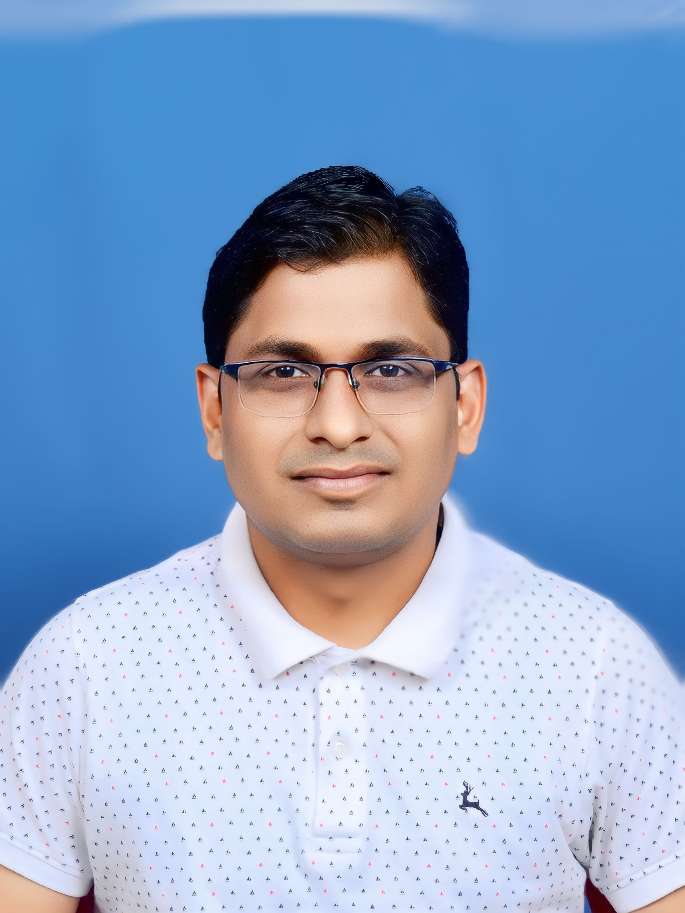

    <h1 style="margin: 0; font-size: 24px; color: #333;">Radhakishan Surwase</h1>
    <h3 style="margin: 0; font-size: 18px; color: #555;">Lead Software Engineer</h3>
    

        📠Pune, India 
        📠(+91) 8263892654 
        ✉️ <a href="mailto:radhakishans@hotmail.com" style="color: #007BFF;">radhakishans@hotmail.com</a> 
        
        
    

---

## 🌟 **Profile**  
- 🚀 **12+ years of professional experience**, with 6+ years in **Golang development**.  
- 🛠️ Expertise in designing and implementing **scalable microservices architectures**.  
- ⚡ Skilled in optimizing **high-concurrency systems** and solving complex challenges.  
- 🌍 Proficient in **cloud-native technologies**, distributed systems, and advanced data pipelines.  
- 🤝 Experienced in mentoring teams and driving technical excellence in fast-paced environments.  
- 🔐 Passionate about building **secure, maintainable, and high-performance solutions**.  

---

## 🛠 **Skills**

                      

---

## 💼 **Employment History**

### **Lead Software Engineer**  
**LogicMonitor**  
*September 2024 – Present*  
- 🛠️ Spearheaded the design and implementation of **Golang-based microservices**, improving reliability and observability.  
- 🚀 Built a **log monitoring framework** with anomaly detection and real-time aggregation.  
- 📊 Designed optimized data ingestion pipelines for high-throughput event streams.  
- 💡 Led technical reviews and **architectural discussions** to establish best practices.  
- 🤝 Mentored junior developers on **Golang concurrency patterns** and performance optimization.  
- 🛡️ Enhanced system **security** through advanced authentication mechanisms.

### **Senior Software Engineer - L4**  
**MAERSK GSC, Pune**  
*October 2023 – September 2024*  
- 🚢 Architected high-performance data pipelines for seamless **vessel data integration**.  
- 📈 Improved CI/CD pipelines with automated code quality checks and **real-time monitoring tools**.  
- ⚡ Designed event-driven communication systems using **ActiveMQ** for asynchronous processing.  
- 🧑‍🏫 Conducted workshops on **Golang best practices** and system design.  
- ⚙️ Optimized resource utilization through advanced **concurrency mechanisms**.  
- 💾 Improved data consistency using distributed transactions.

### **Senior Technical Lead**  
**Encora Inc., Pune**  
*July 2021 – October 2023*  
- 🏗️ Built AWS monitoring microservices from scratch, enhancing visibility into **distributed cloud environments**.  
- ⏱️ Designed **fault-tolerant systems** for real-time metric collection, significantly reducing downtime.  
- 📊 Implemented distributed **data pipelines** for high-volume datasets.  
- 🤝 Collaborated with teams to address customer issues and implement scalable solutions.  
- 📅 Participated in **roadmap planning** and technical grooming sessions to align project goals.  
- 🛠️ Automated deployment processes, improving overall delivery time.

### **Technical Lead**  
**MKCL, Pune**  
*October 2012 – July 2021*  
- 📚 Delivered innovative solutions in **e-learning and educational administration**, transforming user experiences.  
- 🚀 Engineered the **ERA e-Learning framework**, enabling over 1.1 million learners annually.  
- 🏫 Designed the **Digital University Framework**, managing millions of student lifecycles.  
- 🔗 Developed APIs and backend services using **Golang**, **Node.js**, and **Java**.  
- 🧹 Streamlined workflows by implementing **code review processes**.  
- 🌟 Recognized with the **Excellent Performer Award** in 2017 for exceptional contributions.

---

## 🎓 **Education**  
**M.Sc. Computers**  
Dr. Babasaheb Ambedkar Marathwada University, Aurangabad  
*June 2005 – June 2007*  
Percentage: **87.00%**  

**B.Sc. Computers**  
Dr. Babasaheb Ambedkar Marathwada University, Aurangabad  
*June 2002 – June 2005*  
Percentage: **79.00%**  

---

## 🏆 **Achievements**  
- 🏅 **Customer Success Award** — Encora, 2021  
- 🥇 **Excellent Performer Award** — MKCL, 2017  

---

## 📖 **Interests**  
- ✍️ Writing tech blogs on [Medium](https://rksurwase.medium.com/)  
- 🔍 Exploring **Elasticsearch**, **gRPC**, and **Kafka**  
- 🚴 Bike riding and 🥾 hiking  
- 👨‍🍳 Cooking and experimenting with recipes  

---

> "Healing starts with breath and motivation."  
